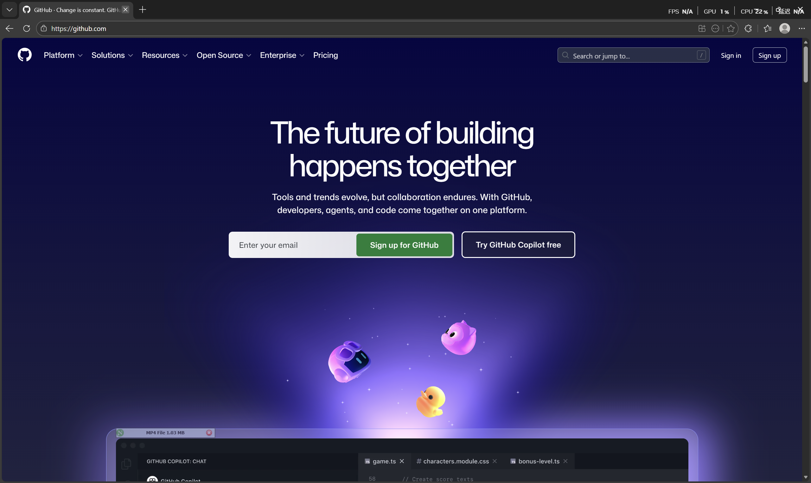
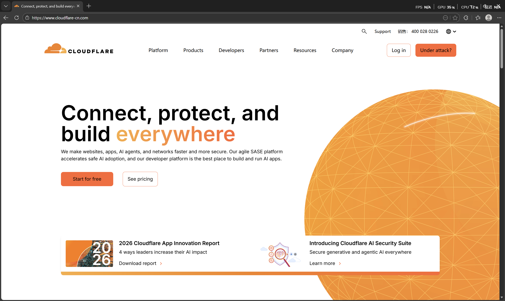

本文将会从零开始带你搭建一个由 hugo 驱动的博客。

## 准备工作

你需要一个邮箱、一台电脑。

接下来一步，注册 GitHub 账号，已有可跳过。

打开 [GitHub](github.com) ，点击右上角 Sign Up。



输入用户名、邮箱、密码，通过人机验证，邮箱激活，就注册好了。

接下来一步，注册 Cloudflare 账号，已有可跳过。

打开 [Cloudflare](cloudflare.com) ，点击中间 Start for free。



老样子，一步一步注册。

接下来我们需要一个域名，如果你有人民币，那你可以买一个。

~~那没有怎么办？这个域名我就是从……~~

我们可以用免费域名。

打开 [register.us.kg](https://register.us.kg)，点击下方 Sign Up。

这边随便去百度一个[美国人名生成器](https://www.toolqd.com/fakename-us)，EMAIL 填自己的，注册后登录，用刚才的 GitHub 账号完成 OAuth。

新注册的账号只有一个域名（我的老账号加上 GitHub star 给的一个一共有 4 个），不过够用。

点击左边 Domain Registration，选择子域名，.dpdns.org 和 .qzz.io 免费，推荐后者，好记。

Check 完后会要求输入名称服务器，这时回到 Cloudflare ，点击添加域，输入你刚才注册的域名，然后 Cloudflare 会给你发两个名称服务器 (Name Server,NS)，填到注册页面，保存。等会儿  Cloudflare 那边打勾就完成了。

## 配置本地环境

接下来配置本地环境。只讲 Windows 的，剩下的请在 [官网](gohugo.io) 阅读。

首先安装 Git，[这里下载](https://git-scm.com/install/windows)，安装途中记得添加到 PATH。


然后下载并安装 [Go](https://golang.google.cn/dl/)。


然后使用我最喜欢的 winget 安装 hugo-extended，运行

```
winget install Hugo.Hugo.Extended
```

当然你要是讨厌 winget，请自行寻求帮助~~嘿嘿嘿~~

接下来如果你觉得我推荐的主题不好，可以自行去[这里](https://themes.gohugo.io/)寻找一个主题，但是接下来的教程都没用了。而且 Stack 可是第二大主题。

打开 [https://github.com/CaiJimmy/hugo-theme-stack-starter](https://github.com/CaiJimmy/hugo-theme-stack-starter)，点击右上角 <>Code，选择 Download ZIP。

解压之后删除我们用不到的 ```.devcontainer```、```.github```、```.vscode``` 文件夹。

在当前目录下运行 ```hugo server```，打开 [localhost:1313](http://localhost:1313/) 可以预览。

## 修改文件

接下来开始魔改！

删除 config/_default/_language.toml（~~反正多语言你也不会写~~）

打开 config/_default/config.toml，  
把 baseurl 改成你的域名（等会讲），  
languageCode 改了好像没用（？），  
title 是网站左上角显示的名称，  
defaultContentLanguage 改成 "zh-cn"，  
hasCJKLanguage 改成 true。

打开 config/_default/menu.toml，这是左上角下面的社交图标，每一个 [[social]] 对应一个，看着格式改。

其中：  
identifier 是给自己看的，  
name 是显示的，  
url 是目标链接，  
下面 .params 的 icon 是图标，可以不要。自己的 icon 可以改成 .svg 格式扔到 /assets/icons/ 里。

打开 config/_default/params.toml，  
since 填建站的年份，  
下面 [article] 把 math 改成 true，启动 LaTeX。
```
[sidebar]
    emoji    = "💤"
    subtitle = "已完成今日我对着铁质的机箱踢了五下然后把那堆代码在内存中删了一下然后把椅子砸在了地板上大学习"
    avatar   = "img/avatar.png"
```
emoji 是显示在邮箱旁边的，  
subtitle 是你的个性签名，  
avatar 是头像，放在 /assets/img 里。

最下面的 commemts 选项是重头戏，我们使用 Giscus，所以把 provider 改成 "giscus"。


接下来在 Github 新建一个 **Public** 仓库，并且把[这个](https://github.com/apps/giscus)安装到你的仓库，然后在 Setting 里启用 Discussion，在[这里](https://giscus.app/zh-CN)，按默认值填下去。最后有一段代码，按这个格式粘贴到你的 provider 下面：
```
    [comments.giscus]
        repo             = 生成的 data-repo
        repoID           = 生成的 data-repo-id
        category         = 生成的 data-category
        categoryID       = 生成的 data-category-id
        mapping          = "title"
        lightTheme       = "light"
        darkTheme        = "dark_dimmed"
        reactionsEnabled = 1
        emitMetadata     = 0
        inputPosition    = "top"
        lang             = "zh-CN"
        strict           = 0
        loading          = "lazy"
```

现在欣赏一下，……LaTeX 是坏的！！！

为了换成国内镜像，我们在博客根目录下新建 data 文件夹，新建 external.toml，把以下内容粘贴进去：

```
KaTeX = [
    { src = "https://cdn.jsdmirror.cn/npm/katex@0.16.9/dist/katex.min.css", integrity = "sha384-n8MVd4RsNIU0tAv4ct0nTaAbDJwPJzDEaqSD1odI+WdtXRGWt2kTvGFasHpSy3SV", type = "style" },
    { src = "https://cdn.jsdmirror.cn/npm/katex@0.16.9/dist/katex.min.js", integrity = "sha384-XjKyOOlGwcjNTAIQHIpgOno0Hl1YQqzUOEleOLALmuqehneUG+vnGctmUb0ZY0l8", type = "script", defer = true },
    { src = "https://cdn.jsdmirror.cn/npm/katex@0.16.9/dist/contrib/auto-render.min.js", integrity = "sha384-+VBxd3r6XgURycqtZ117nYw44OOcIax56Z4dCRWbxyPt0Koah1uHoK0o4+/RRE05", type = "script", defer = true },
]

Cactus = [
    { src = "https://latest.cactus.chat/cactus.js", type = "script" },
    { src = "https://latest.cactus.chat/style.css", type = "style" },
]

[PhotoSwipe]
    Style    = "https://cdn.jsdelivr.net/npm/photoswipe@5.4.4/dist/photoswipe.css"
    Core     = "https://cdn.jsdelivr.net/npm/photoswipe@5.4.4/dist/photoswipe.esm.min.js"
    Lightbox = "https://cdn.jsdelivr.net/npm/photoswipe@5.4.4/dist/photoswipe-lightbox.esm.min.js"
```

LaTeX 就被修好了 ^_^。

## 修改内容

打开 content 文件夹，作为本土化 的一环，把 _index.md 里的 name 换成 主页。

categories 建议满门抄斩之前留一个~~解刨~~参考。详解：
```
---
title: 题解
description: 如果你是来找我的黑历史的，那你赢了。
image:

style:
    background: "#2a9d8f"
    color: "#fff"
---
```
title 是这个 category 的名称，description 是描述，image 作为封面可有可无，background 是标签的底色，color 是字的颜色。

page 里是各种页面。可以参考官方文档增减。

本土化的话修改每个文件夹里 index.md 里的 name。

post 是重点，新建一个文件夹，里面放入 index.md，开头这么写：

```
---
title: 你的标题
date: 你的发布时间（形如2026-02-25T16:42:04+08:00，自己理解）
draft: false
---
```

然后正文用 MarkDown 书写，插入文件可以把资源放在当前文件夹里，引用写成
```
[描述](文件名)
```
。

恭喜你，现在你的博客出来了，开始部署。

## 部署

本地运行 

```
git config --global user.name 你的用户名
git config --global user.email 你的邮箱
ssh-keygen -t rsa -C 你的邮箱
```

一路 yes，打开你的用户目录下的 .ssh文件夹，把 ip_rsa.pub 里的东西复制走。

打开 GitHub，选择 Settings，找到 SSH and GPG keys，New SSH Key，粘进去并 Add。

本地运行
```
ssh -T git@github.com
```

如果链接成功，则有 You've successfully authenticated, but GitHub does not provide shell access 输出。

新建一个 GitHub 库，名字随意。

回到你的博客根目录，运行

```
git init
git add .
git commit -m "你的推送内容"
git remote add origin git@github.com:你的用户名/你的仓库名.git
git push -u origin main
```

打开 Cloudflare，选择 Workers 和 Pages，创建应用程序，点击下方 Pages 旁边的开始使用，导入现有 Git 存储库，添加 GitHub 账户，然后选择你的存储库，框架预设选 hugo，保存并部署。

再添加自定义域名，最好是子域名，例如 blog.你的域名，等一会就能访问。

哦对了，后续更新写完文章执行如下命令

```
git add .
git commit -m "你的推送内容"
git push
```

即可。

## 价格

Github $0$ 元；

域名 $0$ 元，但是一年要续一次；

Cloudflare Pages $0$ 元，每月可以构建 $500$ 次。

总计 $0$ 元。~~为什么？当然是因为我领到了 2026 年的……~~